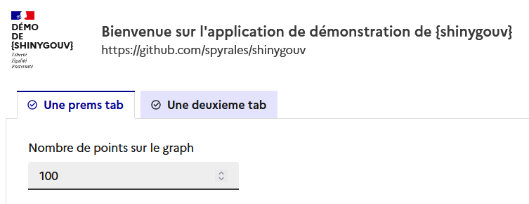

<!-- README.md is generated from README.Rmd. Please edit that file -->

# {shinygouv}

Le package `{shinygouv}` permet d’utiliser le
[`Système de Design de l'Etat`
(DSFR)](https://www.systeme-de-design.gouv.fr/) dans vos applications
Shiny.

Cela leur donnera ce genre de look :



Il s’installe depuis github :

``` r
# install.packages("remotes")
remotes::install_github("spyrales/shinygouv")
```

# Comment utiliser le package

Le package s’utilise comme {shiny}. Voici un exemple minimaliste pour la
partie UI:

``` r
library(shiny)
library(shinygouv)
app_ui <- fluidPage_dsfr(
  header = header_dsfr(
    intitule = c("D\u00e9mo", "de", "{shinygouv}"),
    nom_site_service = "Bienvenue sur l\'application de d\u00e9monstration de {shinygouv}",
    baseline = "https://github.com/spyrales/shinygouv"
  ),
  title = "Exemple",
  fluidRow_dsfr(
    column_dsfr(
      0,
      fileInput_dsfr(inputId = "file1", label = "Ajouter des fichiers", message = "")
    )
  )
)
shinyApp(
  ui = app_ui,
  server = function(input, output) {
  }
)
```

# Visualiser une application de démonstration comprenant les composants déjà implémentés:

[shinygouv-demo](https://ssm-ecologie.shinyapps.io/shinygouv-demo/)

[shinygouv-demo
dev](https://ssm-ecologie.shinyapps.io/shinygouv-demo-dev/), version en
cours de developpement

# Contribuer au développement du package

Voir les vignettes à l’intention des développeurs du [site de
présentation du packages et de ses
fonctions](https://spyrales.github.io/shinygouv/articles/index.html)

# Code of Conduct

Notez svp qu’un Code de conduite ([Contributor Code of
Conduct](https://spyrales.github.io/shinygouv/CODE_OF_CONDUCT.html))
encadre la participation au projet {shinygouv}.

En contribuant à ce projet, vous acceptez de le respecter.
